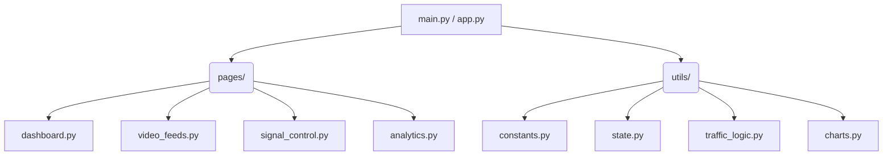

<div align="center">

# 🚦 Smart Traffic Management System

**Deep Learning-inspired dynamic traffic signal control with real-time vehicle density analysis.**

[](#)
[](#)
[](#)
[](#)
[](https://smart-traffic-management-system-s9en.onrender.com)
> *An intelligent, AI-driven traffic intersection dashboard capable of dynamic signal allocation, automated emergency vehicle prioritization, and highly responsive real-time analytics.*

</div>


## 📖 About the Project

Traditional traffic light systems operate on fixed timers, leading to unnecessary congestion, increased emissions, and critical delays for emergency vehicles. **Smart Traffic Management System** tackles this problem by providing a modern, software-based approach to intersection control. 

By simulating the integration of Deep Learning (like YOLOv8) and computer vision, this dashboard dynamically calculates optimal green-light times based on the exact density of vehicles waiting in each lane. Furthermore, it features an automated override system that instantly detects ambulances or fire engines, clearing their path to save crucial response time. Whether you are analyzing historical traffic trends or monitoring live intersection feeds, this system offers a comprehensive, visually stunning interface for the future of smart city infrastructure.

---

## ✨ Key Features

- 🧠 **Dynamic AI Signal Control**: Simulates intelligent traffic light phases dynamically allocated based on real-time lane vehicle densities.
- 🚨 **Emergency Priority Protocol**: Automatically overrides standard light phases to grant immediate green-light priority to ambulances and emergency response vehicles.
- 📊 **Real-Time Analytics Dashboard**: Monitor the intersection through an interactive dashboard featuring Plotly-rendered traffic light SVGs, density bar charts, and live KPIs.
- 📹 **Live Video Feed Simulation**: Simulates CCTV camera feeds using deep learning representations (YOLOv8-style bounding boxes) and allows for custom video file uploads.
- 📈 **Historical Data & Trends**: Comprehensive analytics tab tracking traffic flow trends, signal cycle counts, and vehicle categorization over time.
- 🌗 **Premium UI/UX Design**: Built with a sleek, responsive dark-mode interface, custom CSS micro-animations, and intuitive system alerts.

---

## 🛠️ Technology Stack

| Category | Technologies |
| :--- | :--- |
| **Frontend UI** | Streamlit, HTML5, Vanilla CSS |
| **Data Visualization** | Plotly Graph Objects, Plotly Express |
| **Backend & Logic** | Python, Pandas, NumPy |
| **CV Simulation** | OpenCV, YOLOv8 conceptual modeling |

---

## 📂 Project Architecture



<details>
<summary><b>Click to expand folder tree</b></summary>

```text
smart_traffic/
├── app.py                  # Main Streamlit application entry point
├── main.py                 # Alternative execution wrapper
├── requirements.txt        # Python dependencies
├── pages/                  # Streamlit multi-page dashboard views
│   ├── dashboard.py        # KPIs, traffic lights, and density comparison
│   ├── video_feeds.py      # Camera views and video upload simulation
│   ├── signal_control.py   # Signal phases and emergency overrides
│   └── analytics.py        # Historical data and trend charts
└── utils/                  # Helper modules
    ├── constants.py        # Configuration and UI tokens
    ├── state.py            # Session state and simulation tick logic
    ├── traffic_logic.py    # Green time calculation algorithms
    └── charts.py           # Reusable Plotly chart components
```
</details>

---

## 🚀 Installation & Setup

Get the system up and running on your local machine in under 3 minutes.

**1. Clone the repository**
```bash
git clone https://github.com/YourUsername/smart-traffic-management.git
cd smart-traffic-management
```

**2. Create a virtual environment** (Highly Recommended)
```bash
python -m venv .venv
```
*Activate it:*
- Windows: `.venv\Scripts\activate`
- Mac/Linux: `source .venv/bin/activate`

**3. Install the requirements**
```bash
pip install -r requirements.txt
```

**4. Launch the dashboard**
```bash
streamlit run app.py
```

---

## 💡 Usage Guide

1. **Simulation Control**: Utilize the left-hand sidebar to switch seamlessly between **"Dynamic (AI)"** mode and **"Manual"** mode.
2. **System Toggles**: Pause, resume, or completely reset the simulation parameters at any time from the sidebar.
3. **Manual Overrides**: Need to force a green light? Switch to Manual Mode and select the designated lane to clear traffic instantly.
4. **Data Injection**: Navigate to the `Video Feeds` tab to upload custom `.mp4` files and test how the dashboard visually represents object detection logic.

---

## 📄 License

This software is released under the **[MIT License](./LICENSE)**. You are free to use, modify, and distribute it for both commercial and non-commercial purposes.

<div align="center">
  <br>
  <i>Built with ❤️ for smarter, safer cities.</i>
</div>
